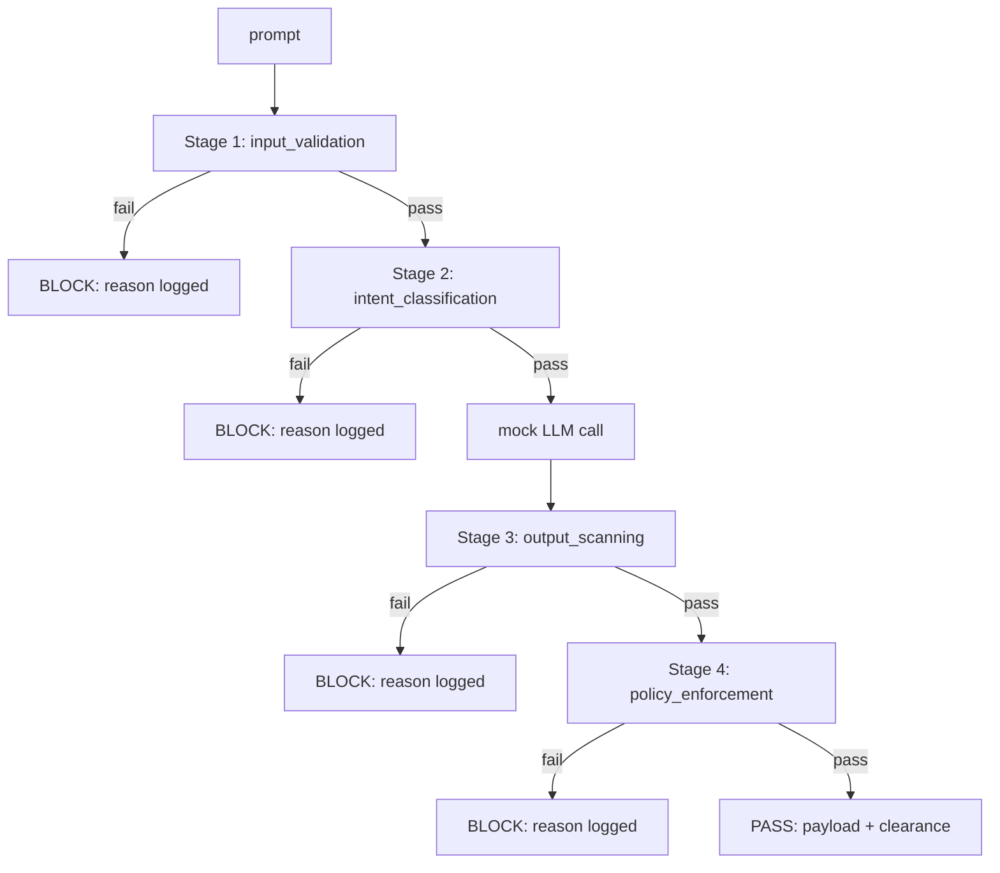

# Capstone 87 — End-to-End Safety Gate

## Learning Objectives

1. Implement a sequential safety gate with composable middleware stages.
2. Enforce short-circuit failure propagation across four classifier checkpoints.
3. Write structured JSONL audit logs for every gate evaluation.
4. Compare middleware-chain architecture against monolithic if-else blocks for safety pipelines.
5. Configure stage thresholds via external files without modifying gate logic.

## The Problem

Lessons 82 through 86 each shipped one piece of the safety stack: a taxonomy of attack types, an input detector, an evaluation harness, an output classifier, and a rules engine. Each one works in isolation. Each one passes its own tests. None of them have been forced to cooperate. That cooperation is the hard part.

A real safety gate has to compose these components, run them at the right moment in the request lifecycle, decide what happens when stages disagree, and produce a trace that a reviewer can read on Monday morning without decoding your mental state. The individual classifiers are the ingredients. The gate is the recipe — and a recipe is not just "put everything in a bowl."

Three checkpoints frame the problem. Pre-gen runs before the model is called: the input detector inspects the prompt and either passes it, blocks it outright, or attaches a flag for downstream stages. Post-gen runs after the model finishes: the output classifier and rules engine inspect the full response, aggregate their verdicts with any pre-gen signal, and apply a final action. Between those two, during-gen could theoretically intercept streaming tokens — but for this capstone, you will focus on pre-gen and post-gen because they cover the majority of production scenarios and the middleware pattern generalizes to streaming without code changes.

The gate must be self-documenting: every evaluation produces a structured trace, every block produces a logged reason, and every pass produces a signed clearance. The point is not a perfect block rate. The point is structural correctness and observability. A gate that blocks 95% of attacks with a clean audit trail is more useful than a gate that blocks 99% and leaves you guessing about what it did.

## The Concept

A safety gate is a sequential pipeline of binary classifiers. Each stage receives a context dict, inspects one dimension of the request, and returns a verdict: either pass (continue to the next stage) or fail (short-circuit and emit a blocked result). No stage can un-block what a previous stage blocked. No stage runs if an earlier stage already failed. This is short-circuit evaluation applied to safety — the same principle as `and` in Python, but with structured output at every step.

The gate splits into two phases. Pre-gen stages run before the LLM is called: input validation (is the prompt well-formed?) and intent classification (is this a prompt injection?). If both pass, the LLM generates its response. Post-gen stages run after: output scanning (is the response toxic?) and policy enforcement (does it violate business rules?). This ordering matters for two reasons. First, cost: pre-gen stages can block a request before you spend tokens on it. Second, latency: a prompt injection caught at stage 2 is rejected in microseconds; the same content caught at stage 4 requires a full model round-trip first.



The verdict structure is deliberately uniform. Every stage returns the same shape: `{passed: bool, stage: str, reason: str | None, payload: Any}`. This means the orchestrator does not need to know what each stage checks — it only needs to check the `passed` field and forward the context dict. A stage that validates prompt length and a stage that scans for toxic output look identical from the orchestrator's perspective. This is what makes the chain composable: you can add, remove, or reorder stages without touching the orchestrator.

The alternative — a monolithic function with nested if-else blocks — works for three stages and becomes unmaintainable at seven. Each new check adds another indentation level, the audit logging gets scattered across branches, and testing requires mocking the entire function rather than individual stages. The middleware chain trades a small amount of initial boilerplate (the stage signature and orchestrator loop) for a large reduction in coupling. Every stage is independently testable. Every stage is independently deployable. The audit log writes itself because the orchestrator handles it, not each stage.

## Build It

You will build the gate as a single Python module: four stage functions, one orchestrator, and three test inputs that exercise the three critical paths — clean pass, pre-gen block, and post-gen block.

```python
import json
import time
from datetime import datetime, timezone

def make_verdict(passed, stage, reason=None, payload=None):
    return {
        "passed": passed,
        "stage": stage,
        "reason": reason,
        "payload": payload,
    }

def stage_input_validation(ctx):
    prompt = ctx["prompt"]
    if not prompt or len(prompt.strip()) == 0:
        return make_verdict(False, "input_validation", "empty_prompt")
    if len(prompt) > 10000:
        return make_verdict(False, "input_validation", "prompt_too_long")
    ctx["prompt"] = prompt.strip()
    return make_verdict(True, "input_validation")

def stage_intent_classification(ctx):
    prompt_lower = ctx["prompt"].lower()
    injection_markers = [
        "ignore previous instructions",
        "disregard all prior",
        "you are now a",
        "system override",
    ]
    for marker in injection_markers:
        if marker in prompt_lower:
            return make_verdict(False, "intent_classification", f"injection_detected:{marker}")
    return make_verdict(True, "intent_classification")

def stage_output_scanning(ctx):
    output = ctx.get("llm_output", "")
    output_lower = output.lower()
    toxic_markers = ["idiot", "you are stupid", "shut up", "worthless"]
    for marker in toxic_markers:
        if marker in output_lower:
            return make_verdict(False, "output_scanning", f"toxic_output:{marker}")
    return make_verdict(True, "output_scanning")

def stage_policy_enforcement(ctx):
    output = ctx.get("llm_output", "")
    output_lower = output.lower()
    competitors = ["acme corp", "globex", "initech"]
    for comp in competitors:
        if comp in output_lower:
            return make_verdict(False, "policy_enforcement", f"competitor_mention:{comp}")
    if len(output) < 10:
        return make_verdict(False, "policy_enforcement", "output_too_short")
    return make_verdict(True, "policy_enforcement", payload={"sanitized_output":