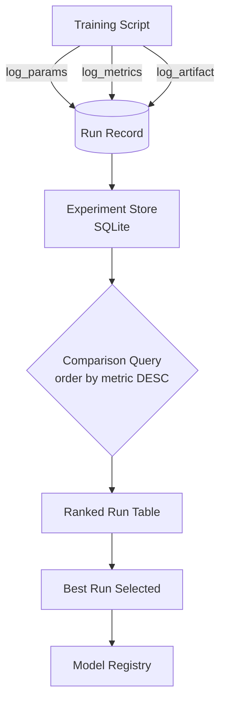

# MLOps 01 — Experiment Tracking

## Learning Objectives

1. Log parameters, metrics, and artifacts for multiple training runs to an MLflow tracking server backed by SQLite.
2. Query and rank experiment runs by metric to identify the best-performing configuration.
3. Register a trained model to the MLflow Model Registry with version and stage labels.
4. Compare experiment tracking (append-only recording) with model registry (declarative state management).

## The Problem

You trained three models this week. Two outperformed the baseline. You cannot remember which learning rate you used for either of them, and the one notebook where you think you wrote it down has been overwritten by a later run. The model files are sitting in a directory called `models/` with names like `model_v2_final_REAL.pkl` and `model_v2_final_ACTUALLY_FINAL.pkl`. This is not a hypothetical scenario — it is the default state of model development without tracking infrastructure.

The cost of this disorganization compounds. When your VP asks "why did we ship this scoring model instead of the other one?", you have no audit trail. When you want to improve the model next quarter, you cannot reconstruct the baseline because you do not know which hyperparameters produced it. When a teammate inherits your project, they start from scratch because your experiment history lives in your head and your browser history, neither of which is searchable by metric value.

This is an operational failure, not a theoretical one. Every model you train without structured logging is a model you will have to retrain from scratch when someone asks a question about it. Experiment tracking solves this by making the recording automatic and the retrieval queryable — before you ever need it.

## The Concept

An experiment tracker is a structured write-ahead log for model training. Every training run appends a record containing three categories of information: parameters (inputs you set before training), metrics (outputs you measure after or during training), and artifacts (files you produce, such as model weights or plots). The tracker never mutates past records — it only appends new ones. This append-only guarantee is what makes the log trustworthy: you can query historical runs without worrying that someone edited the results retroactively.

The minimal schema for a run is a run ID (unique identifier), timestamp, the parameter dictionary, the metric dictionary, and a list of artifact paths. Given this schema, the primary operation is comparison: sort all runs by a metric value, filter by parameter, and identify which configuration produced the best result. Without this operation, you have a pile of logs. With it, you have a decision-making tool.



The mechanism is simple enough that you could build a primitive version with a CSV file and a sorting function. The reason tools like MLflow exist is that they handle the infrastructure around this log: concurrent writes from parallel training jobs, a query API for filtering and sorting, a UI for visual comparison, and a storage backend that survives process restarts. MLflow implements this append-only log with a SQLite backend for local development and a SQL database for team deployments. The schema, the comparison operation, and the guarantees are the same at either scale.

## Build It

You will write a Python script that trains a simple classifier on a synthetic dataset, logs hyperparameters and accuracy to a local MLflow tracking server, and prints the top 5 runs sorted by accuracy. MLflow is the tool that solves the problem of "where do I write these records" — it provides a SQLite-backed store and a comparison API so you do not have to build one from scratch.

Install the dependencies first:

```bash
pip install mlflow scikit-learn
```

Then run this script. It trains five RandomForest configurations, logs each to MLflow, and prints a ranked table:

```python
import mlflow
import mlflow.sklearn
from sklearn.datasets import make_classification
from sklearn.model_selection import train_test_split
from sklearn.ensemble import RandomForestClassifier
from sklearn.metrics import accuracy_score
from mlflow.tracking import MlflowClient

mlflow.set_tracking_uri("sqlite:///mlflow.db")
mlflow.set_experiment("lead_scoring_baseline")

X, y = make_classification(
    n_samples=1000,
    n_features=20,
    n_informative=10,
    n_redundant=5,
    random_state=42,
)
X_train, X_test, y_train, y_test = train_test_split(
    X, y, test_size=0.2, random_state=42
)

configs = [
    {"n_estimators": 50, "max_depth": 5},
    {"n_estimators": 100, "max_depth": 10},
    {"n_estimators": 200, "max_depth": 15},
    {"n_estimators": 50, "max_depth": 15},
    {"n_estimators": 100, "max_depth": 5},
]

for config in configs:
    with mlflow.start_run():
        mlflow.log_params(config)
        model = RandomForestClassifier(**config, random_state=42)
        model.fit(X_train, y_train)
        preds = model.predict(X_test)
        acc = accuracy_score(y_test, preds)
        mlflow.log_metric("accuracy", acc)
        mlflow.sklearn.log_model(model, "model")

client = MlflowClient()
experiment = client.get_experiment_by_name("lead_scoring_baseline")
runs = client.search_runs(
    [experiment.experiment_id],
    order_by=["metrics.accuracy DESC"],
    max_results=5,
)

print(f"{'Run ID':<12} {'n_estimators':<15} {'max_depth':<12} {'accuracy':<10}")
print("-" * 49)
for run in runs:
    p = run.data.params
    m = run.data.metrics
    print(
        f"{run.info.run_id[:8]:<12} "
        f"{p.get('n_estimators', '?'):<15} "
        f"{p.get('max_depth', '?'):<12} "
        f"{m.get('accuracy', 0):.4f}"
    )
```

The output is a ranked table. Every row is a run you can reproduce because the parameters are logged alongside the metric. If someone asks "which configuration won?", you point at the top row. If they ask "what was the accuracy of the 50-tree/depth-15 variant?", you scan the table. The append-only log did the work; the query retrieved it.

## Use It

Experiment tracking maps directly to ICP scoring and enrichment workflows (Zone 2 — Enrichment & Scoring). When you build a lead scoring model, you run dozens of experiments with different feature sets and hyperparameter configurations. The question "which feature configuration produced the highest conversion-rate lift?" is exactly the comparison operation the tracker enables. Without tracking, you are guessing. With it, you have a ranked table of every configuration you tried, the metrics each produced, and the parameters that generated each result.

In a Tier 2 context — accounts 101 through 1,000, where segment-level personalization replaces one-to-one manual work [CITATION NEEDED — concept: Tier 2 GTM motion definition] — your scoring model determines which accounts receive which automated sequence. The model's feature set and threshold configuration directly affect which leads enter the pipeline. If you changed the feature set and conversion improved by 3%, you need to know that happened, which features caused it, and whether the improvement is reproducible. That is the comparison query against your experiment log.

Here is a script that runs a lead scoring experiment with three feature configurations and two model types, logging all of it to MLflow:

```python
import mlflow
import mlflow.sklearn
import numpy as np
from sklearn.linear_model import LogisticRegression
from sklearn.ensemble import GradientBoostingClassifier
from sklearn.model_selection import train_test_split
from sklearn.metrics import accuracy_score, f1_score
from mlflow.tracking import MlflowClient

mlflow.set_tracking_uri("sqlite:///mlflow.db")
mlflow.set_experiment("icp_lead_scoring")

np.random.seed(42)
n = 500
employee_count = np.random.randint(5, 5000, n)
engagement_score = np.random.uniform(0, 100, n)
website_visits = np.random.randint(1, 50, n)
days_since_signup = np.random.randint(1, 90, n)
industry_match = np.random.choice([0, 1], n, p=[0.7, 0.3])

X_full = np.column_stack([
    employee_count, engagement_score, website_visits,
    days_since_signup, industry_match,
])
z = (
    -2
    + 0.0005 * employee_count
    + 0.03 * engagement_score
    + 0.02 * website_visits
    - 0.02 * days_since_signup
    + 1.5 * industry_match
)
prob = 1 / (1 + np.exp(-z))
y = (prob > np.random.uniform(0.3, 0.7, n)).astype(int)

X_train, X_test, y_train, y_test = train_test_split(
    X_full, y, test_size=0.2, random_state=42
)

feature_sets = {
    "firmographic_only": [0],
    "engagement_only": [1, 2],
    "full_signal": [0, 1, 2, 3, 4],
}

models = {
    "logistic": LogisticRegression(max_iter=1000, random_state=42),
    "gbm": GradientBoostingClassifier(random_state=42),
}

for fs_name, fs_indices in feature_sets.items():
    for model_name, model_cls in models.items():
        with mlflow.start_run():
            model = type(model_cls)(**model_cls.get_params())
            mlflow.log_params({
                "feature_set": fs_name,
                "model_type": model_name,
                "num_features": len(fs_indices),
            })
            model.fit(X_train[:, fs_indices], y_train)
            preds = model.predict(X_test[:, fs_indices])
            acc = accuracy_score(y_test, preds)
            f1 = f1_score(y_test, preds)
            mlflow.log_metric("accuracy", acc)
            mlflow.log_metric("f1_score", f1)
            mlflow.sklearn.log_model(model, "model")

client = MlflowClient()
experiment = client.get_experiment_by_name("icp_lead_scoring")
runs = client.search_runs(
    [experiment.experiment_id],
    order_by=["metrics.f1_score DESC"],
    max_results=5,
)

print(f"{'Feature Set':<20} {'Model':<12} {'Accuracy':<10} {'F1':<8}")
print("-" * 50)
for run in runs:
    p = run.data.params
    m = run.data.metrics
    print(
        f"{p.get('feature_set', '?'):<20} "
        f"{p.get('model_type', '?'):<12} "
        f"{m.get('accuracy', 0):.4f}     "
        f"{m.get('f1_score', 0):.4f}"
    )
```

Every row in that output is a defensible decision. When someone asks why you chose the full-signal GBM over the firmographic-only logistic regression, you show them the F1 delta. The experiment log converts "I think this works better" into "here is the evidence."

## Ship It

Tracking records what happened. A registry declares what should happen next. The transition from experiment tracking to model registry is the transition from "I ran these experiments and here are the results" to "this specific model version is the one we serve to production." The registry is a versioned store with status labels — Staging, Production, Archived — that your serving infrastructure reads to decide which model to load.

The mechanism is straightforward. You take a run from the tracking server, register its model artifact under a named model entry, and the registry assigns it a version number starting at 1. Each version can be transitioned between stages. Multiple versions can exist simultaneously — you might have version 3 in Production and version 4 in Staging for evaluation. The registry does not care about training; it cares about deployment state.

Here is a script that registers the best run from the lead scoring experiment and transitions it through stages:

```python
import mlflow
from mlflow.tracking import MlflowClient

mlflow.set_tracking_uri("sqlite:///mlflow.db")

client = MlflowClient()
experiment = client.get_experiment_by_name("icp_lead_scoring")
runs = client.search_runs(
    [experiment.experiment_id],
    order_by=["metrics.f1_score DESC"],
    max_results=1,
)

best_run = runs[0]
model_uri = f"runs:/{best_run.info.run_id}/model"
model_name = "icp_lead_scoring_model"

mv = mlflow.register_model(model_uri, model_name)
print(f"Registered: {model_name} version {mv.version}")
print(f"Source run: {best_run.info.run_id[:8]}")
print(f"F1 score: {best_run.data.metrics.get('f1_score', '?')}")
print(f"Feature set: {best_run.data.params.get('feature_set', '?')}")

client.transition_model_version_stage(
    name=model_name,
    version=mv.version,
    stage="Staging",
)
print(f"Stage: Staging")

client.transition_model_version_stage(
    name=model_name,
    version=mv.version,
    stage="Production",
)
print(f"Stage: Production")

print("\nAll registered versions:")
versions = client.search_model_versions(f"name='{model_name}'")
for v in sorted(versions, key=lambda x: int(x.version)):
    print(
        f"  v{v.version} | stage={v.current_stage} | "
        f"run={v.run_id[:8]}"
    )
```

In a GTM context, the model you transition to Production is the one that scores every inbound lead. If your CRM or Clay workflow calls a model endpoint, that endpoint reads the registry's Production stage to determine which version to serve. When you train a better model next month, you register it as a new version, test it in Staging, and transition it to Production — the serving layer picks up the change without code deployment. [CITATION NEEDED — concept: CRM/Clay integration with model serving endpoints]

## Exercises

**Easy:** Modify one hyperparameter in the Build It script (change `n_estimators` or `max_depth` to a value not in the original list) and re-run. Confirm the new run appears in the printed results table.

**Medium:** Add F1 score as a second metric to the Build It logging loop. Modify the comparison query to sort by F1 instead of accuracy, and print a table showing both metrics side by side.

**Hard:** Log a confusion matrix image as an artifact for each run in the Build It script. After the runs complete, write code that retrieves the artifact path for the best-performing run and prints it. You will need `from sklearn.metrics import confusion_matrix` and `import matplotlib.pyplot as plt` to generate the image, and `mlflow.log_artifact()` to store it.

**Ship It Easy:** Register the best run from the `icp_lead_scoring` experiment and print its version number.

**Ship It Medium:** Write a script that queries the registry for `icp_lead_scoring_model`, finds the current Production version, and prints its full parameter set.

**Ship It Hard:** Write a script that simulates a rollout: register a new version, transition it to Staging, print a "validation passed" message if its F1 score is higher than the current Production version, then transition it to Production if validation passes. Otherwise, archive it.

## Key Terms

- **Run** — A single execution of a training script, identified by a unique run ID. Contains parameters, metrics, and artifacts.
- **Parameter** — An input to training that you set before the run starts (e.g., `n_estimators`,