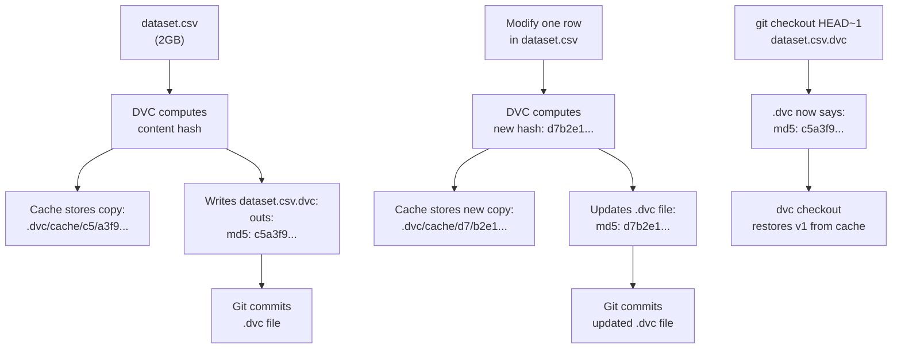

# MLOps 02 — Data Versioning

## Learning Objectives

- Compute SHA-256 content hashes for files and explain how content-addressable storage enables deduplication
- Initialize a DVC project, track datasets with `dvc add`, and restore previous dataset versions through Git history
- Configure DVC remote storage and execute push, delete, and pull operations for dataset recovery
- Write a training script that logs dataset hashes as model metadata and verifies dataset identity on model load
- Diff dataset versions to isolate which data changes caused downstream behavior shifts

## The Problem

A model produces different results after retraining. The code didn't change. The hyperparameters didn't change. The data changed — and nobody recorded which version the previous model used. You have a model artifact with no provenance. When someone asks why predictions shifted, you cannot reproduce the exact training run because you cannot reconstruct the exact input data.

This problem compounds in production. A retraining pipeline pulls from a database or feature store that is live — records get added, corrected, or deleted between runs. If you trained v1 on 50,000 rows and v2 on 50,312 rows with 14 modified records, the model's behavior change might come entirely from those 14 records. Without data versioning, you cannot isolate them. You cannot diff them. You cannot roll back to them.

Git solves this for code. Every commit is a snapshot, and you can checkout any version. But Git tracks line-by-line text changes. A 2GB Parquet file or a 500MB CSV does not fit that model — Git would choke, the repository would balloon, and every clone would download every version of every dataset. You need a versioning mechanism designed for large files that change in unpredictable ways.

## The Concept

The core mechanism is **content-addressable storage**. Instead of naming a file by a human-readable label ("customers.csv"), you name it by a hash of its contents. The hash is deterministic: the same bytes always produce the same hash. Change a single byte and the hash is completely different. This is the SHA-256 algorithm — the same family of cryptographic hash functions Git uses internally.

```python
import hashlib

def content_hash(filepath):
    with open(filepath, 'rb') as f:
        return hashlib.sha256(f.read()).hexdigest()

with open('dataset_v1.csv', 'w') as f:
    f.write('name,email\nAlice,alice@example.com\nBob,bob@example.com\n')

with open('dataset_v2.csv', 'w') as f:
    f.write('name,email\nAlice,alice@example.com\nBob,bob@changed.com\n')

hash_v1 = content_hash('dataset_v1.csv')
hash_v2 = content_hash('dataset_v2.csv')

print(f'v1 hash: {hash_v1}')
print(f'v2 hash: {hash_v2}')
print(f'Same file: {hash_v1 == hash_v2}')
print(f'Shared prefix chars: {sum(a==b for a,b in zip(hash_v1, hash_v2))} / 64')
```

The only difference between those two files is "example" versus "changed" in one email field. The hashes share no meaningful prefix. This avalanche property — any single-bit change cascades into a completely different output — is what makes content-addressable storage work. You can determine whether two multi-gigabyte files are identical by comparing 64-character strings.

DVC (Data Version Control) implements this pattern for ML datasets. It computes a content hash for your dataset, stores the dataset in a content-addressed cache directory (files named by their hash), and writes a small `.dvc` text file containing the hash and file metadata. Git tracks the `.dvc` file. When you modify the dataset and run `dvc add` again, DVC writes a new `.dvc` file with the new hash. Git records the change to the `.dvc` file, and you can restore any historical version by checking out the corresponding Git commit and running `dvc checkout` — which reads the hash from the old `.dvc` file and restores the matching data from the cache.



The `.dvc` file is tiny — a few lines of YAML. Git handles it efficiently. The actual data lives in DVC's cache, deduplicated by content hash. Two commits that share 99% of their rows store only one copy of the shared content and one copy of the changed content. The cache grows with actual data changes, not with commit count.

## Build It

### Easy: Track and Restore Dataset Versions

Initialize a DVC project inside a Git repo, add a dataset, commit the metafile, modify the data, and restore the old version. Every step prints observable output so you can confirm the mechanism.

```bash
mkdir -p dvc-demo && cd dvc-demo
git init -q
dvc init -q
git commit -q -m "Initialize DVC"

printf 'name,email,company\nAlice,alice@acme.com,Acme\nBob,bob@globex.com,Globex\nCarol,carol@initech.com,Initech\n' > customers.csv

dvc add customers.csv

echo "=== .dvc metafile ==="
cat customers.csv.dvc

echo ""
echo "=== .gitignore entries ==="
cat .gitignore

echo ""
echo "=== Row count v1 ==="
wc -l < customers.csv

git add customers.csv.dvc .gitignore
git commit -q -m "Add customers dataset v1"

printf 'Dave,dave@hooli.com,Hooli\n' >> customers.csv

dvc add customers.csv
git add customers.csv.dvc
git commit -q -m "Add Dave to customers dataset"

echo ""
echo "=== Row count v2 ==="
wc -l < customers.csv

git checkout HEAD~1 -- customers.csv.dvc
dvc checkout

echo ""
echo "=== After restoring v1 ==="
wc -l < customers.csv

git checkout HEAD -- customers.csv.dvc
dvc checkout

echo ""
echo "=== Back to v2 ==="
wc -l < customers.csv
```

The row count goes 3 → 4 → 3 → 4. `dvc checkout` reads the hash from whichever `.dvc` file Git currently has checked out and restores the matching bytes from cache. The CSV itself is never committed to Git — only the `.dvc` pointer is.

### Medium: Remote Storage and Pull

Push data to local filesystem remote storage, simulate data loss by deleting the local file, and pull it back. This demonstrates how teams share versioned datasets without committing them to Git.

```bash
dvc remote add -d myremote /tmp/dvc-storage

dvc push

echo "=== Remote directory structure ==="
find /tmp/dvc-storage -type f | head -10

rm customers.csv
rm -rf .dvc/cache

echo ""
echo "=== After deleting local data + cache ==="
ls customers.csv 2>&1 || echo "customers.csv: gone"

dvc pull

echo ""
echo "=== After dvc pull ==="
cat customers.csv
echo ""
wc -l < customers.csv
```

The `find` output reveals the content-addressable layout: directories named with