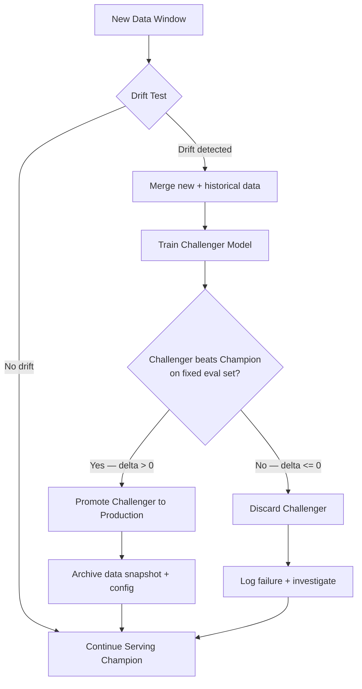

# MLOps 04 — Retraining Pipelines

## Learning Objectives

1. Distinguish between covariate drift, concept drift, and prediction drift by computing distribution differences on input features, input-output relationships, and model outputs.
2. Implement a Kolmogorov-Smirnov drift detector that flags feature distribution shifts at a configurable significance threshold.
3. Build a champion-challenger validation gate that compares a retrained model against the production incumbent on a fixed evaluation set and conditionally promotes the challenger.
4. Construct a retraining trigger function that fires based on scheduled intervals, metric degradation, or statistical drift signals.
5. Trace the full retraining pipeline from data fetch through validation gate to promotion decision, identifying the decision points that prevent performance regressions.

## The Problem

Models decay. The data distribution that produced your training set never stays still. A lead scoring model trained on Q2 inbound traffic will face different conversion patterns by Q4 — different industries in the mix, different pricing page behaviors, different email engagement baselines. A retraining pipeline is the mechanism that detects when that decay matters and automates the response. Without it, you are running a time-limited model and hoping the clock has not expired.

The decay is not uniform and it is not always obvious. Some shifts are gradual — a slow change in the companies visiting your site over weeks. Others are sudden — a competitor launches a new product and your negative-class rate spikes overnight. A model that scored 0.89 F1 at deployment might quietly drop to 0.72 without any error, any crash, or any alarm. The pipeline exists to make that decline visible and to respond before it affects business decisions.

The cost of not having one compounds. Every day a decayed model runs, it makes worse decisions — leads mis-prioritized, intent mis-classified, ICP fit mis-judged. Those decisions generate data that feeds back into the next training cycle, propagating the error. A retraining pipeline interrupts that loop by inserting a validation gate between "the model is underperforming" and "ship a replacement."

## The Concept

**Drift taxonomy.** Three failure modes, each requiring a different detection strategy. Covariate drift occurs when the input distribution shifts — the feature values your model sees at inference time no longer match the distribution it was trained on. A lead scoring model trained when 60% of inputs were from mid-market SaaS companies will experience covariate drift if the inbound mix shifts toward enterprise healthcare. Concept drift occurs when the relationship between inputs and outputs changes — the same features that once predicted conversion no longer do. A model trained before a pricing change may see the same feature vectors but produce wrong predictions because the mapping from features to outcome has been rewritten. Prediction drift occurs when the model's output distribution changes even if the inputs haven't — this can signal that the model is becoming miscalibrated or that the decision boundary is no longer appropriate for the current environment. Each mode demands its own detector: covariate drift calls for input distribution tests, concept drift calls for performance monitoring on labeled windows, and prediction drift calls for output distribution monitoring.

**Retraining triggers.** Three common architectures, often combined. Scheduled triggers fire on a calendar — weekly, monthly, quarterly — regardless of whether drift has occurred. They are simple to implement and provide a baseline cadence, but they waste compute when nothing has changed and can be too slow when drift is sudden. Metric-triggered retraining fires when performance on a labeled window degrades below a threshold. This is the most direct signal — if F1 drops from 0.88 to 0.75, something is wrong — but it requires labeled data, which often arrives with a delay (you don't know if a lead converted until 30 days later). Drift-triggered retraining fires when a statistical test on input or output distributions exceeds a threshold. This catches drift before performance metrics are available, but statistical significance does not always translate to practical impact — a distribution can shift significantly without hurting model performance. Production systems typically layer all three: a scheduled baseline with drift-based early warning and metric-based confirmation.



**The pipeline shape.** Fetch new data, merge with historical training data, preprocess, train a challenger model, validate it against the champion on a fixed evaluation set, then promote or discard. The validation gate is the critical piece. A retrained model that has not proven superiority over the incumbent should never reach production. Automated retraining without an automated validation gate is a performance regression waiting to happen — the new model might fit the recent window better but generalize worse overall, or it might overfit to noise in the new data batch.

**Champion-challenger protocol.** The current production model is the champion. Any retrained candidate is a challenger. The challenger must outperform the champion on a held-out evaluation set — the same evaluation set used to benchmark the champion — before promotion. This protocol prevents the most common failure mode of automated retraining: shipping a model that is newer but worse. The evaluation set should be stable across comparisons. If you change the eval set every time, you cannot tell whether a performance delta is due to the model or the test.

**Data versioning requirement.** Retraining is irreproducible without versioned datasets and versioned training configurations. Every retraining run must be traceable to a specific data snapshot and a specific set of hyperparameters. If a challenger performs worse than expected, you need to answer: what data went in, what preprocessing was applied, what hyperparameters were used, and how does this differ from the champion's training run? Without data versioning — whether through a tool like DVC, a lakehouse table snapshot, or a content-addressed hash of the training parquet — that question is unanswerable. [CITATION NEEDED — concept: data versioning tools for retraining traceability in MLOps]

## Build It

### 1. Drift Detection with the Kolmogorov-Smirnov Test

The KS test compares two empirical distributions and returns a test statistic plus a p-value. The statistic measures the maximum vertical distance between the two cumulative distribution functions. The p-value tells you how likely that distance is under the null hypothesis that both samples come from the same distribution. When the p-value drops below your significance threshold (commonly 0.05), you flag drift.

```python
import numpy as np
from scipy.stats import ks_2samp

np.random.seed(42)

reference_feature = np.random.normal(loc=50, scale=10, size=2000)

drifted_feature = np.random.normal(loc=54, scale=12, size=2000)
stable_feature = np.random.normal(loc=50, scale=10, size=2000)

alpha = 0.05

print("=== Drift Detection: Kolmogorov-Smirnov Test ===\n")

for name, current in [("drifted_feature", drifted_feature), ("stable_feature", stable_feature)]:
    statistic, p_value = ks_2samp(reference_feature, current)
    drift = p_value < alpha
    print(f"Feature: {name}")
    print(f"  Reference mean: {reference_feature.mean():.2f}, std: {reference_feature.std():.2f}")
    print(f"  Current    mean: {current.mean():.2f}, std: {current.std():.2f}")
    print(f"  KS statistic: {statistic:.4f}")
    print(f"  p-value:      {p_value:.6f}")
    print(f"  Drift detected (p < {alpha}): {drift}")
    print()
```

### 2. Champion-Challenger Validation Gate

Train a champion model on a base dataset. Simulate new data arrival. Train a challenger on the combined data. Evaluate both on the same held-out set. The promotion decision is a single comparison: did the challenger beat the champion?

```python
import numpy as np
from sklearn.datasets import make_classification
from sklearn.model_selection import train_test_split
from sklearn.ensemble import GradientBoostingClassifier
from sklearn.metrics import f1_score

np.random.seed(42)

X_base, y_base = make_classification(
    n_samples=5000, n_features=10, n_informative=6,
    weights=[0.7, 0.3], random_state=42
)
X_train_base, X_eval, y_train_base, y_eval = train_test_split(
    X_base, y_base, test_size=0.2, random_state=42
)

champion = GradientBoostingClassifier(random_state=42)
champion.fit(X_train_base, y_train_base)
champion_f1 = f1_score(y_eval, champion.predict(X_eval))

X_new, y_new = make_classification(
    n_samples=2000, n_features=10, n_informative=6,
    weights=[0.6, 0.4], random_state=99
)

X_combined = np.vstack([X_train_base, X_new])
y_combined = np.hstack([y_train_base, y_new])

challenger = GradientBoostingClassifier(random_state=42)
challenger.fit(X_combined, y_combined)
challenger_f1 = f1_score(y_eval, challenger.predict(X_eval))

delta = challenger_f1 - champion_f1
promote = challenger_f1 > champion_f1

print("=== Champion-Challenger Validation Gate ===\n")
print(f"Champion training samples:   {len(X_train_base)}")
print(f"Challenger training samples: {len(X_combined)}")
print(f"Fixed evaluation samples:    {len(X_eval)}")
print(f"\nChampion F1 (eval set):   {champion_f1:.4f}")
print(f"Challenger F1 (eval set): {challenger_f1:.4f}")
print(f"Delta:                    {delta:+.4f}")
print(f"\nPromotion decision: {'PROMOTE CHALLENGER' if promote else 'KEEP CHAMPION'}")

champion_neg = np.sum(champion.predict(X_eval) == 0)
challenger_neg = np.sum(challenger.predict(X_eval) == 0)
print(f"\nChampion negative predictions:   {champion_neg}/{len(X_eval)}")
print(f"Challenger negative predictions: {challenger_neg}/{len(X_eval)}")
```

### 3. Retraining Trigger Logic

A trigger function takes a performance metric history and decides whether to fire. This implementation compares a recent rolling window against an early baseline window and fires when degradation exceeds a threshold.

```python
import numpy as np

def check_retraining_trigger(metric_history, threshold=0.03, window=3):
    if len(metric_history) < window * 2:
        return False, 0.0, "insufficient data"

    baseline = np.mean(metric_history[:window])
    recent = np.mean(metric_history[-window:])
    degradation = baseline - recent

    if degradation > threshold:
        return True, degradation, "metric degradation exceeded threshold"
    return False, degradation, "within tolerance"

performance_log = [0.88, 0.87, 0.89, 0.86, 0.85, 0.82, 0.79, 0.76]

print("=== Retraining Trigger Monitor ===\n")
print(f"{'Window':<8} {'F1':<8} {'Baseline':<12} {'Recent':<12} {'Degradation':<14} {'Decision'}")
print("-" * 72)

for i in range(6, len(performance_log) + 1):
    history_so_far = performance_log[:i]
    trigger, degradation, reason = check_retraining_trigger(history_so_far)
    baseline = np.mean(history_so_far[:3])
    recent = np.mean(history_so_far[-3:])
    decision = f"{'FIRE RETRAIN' if trigger else 'HOLD'} ({reason})"
    print(f"{i:<8} {performance_log[i-1]:<8.2f} {baseline:<12.4f} {recent:<12.4f} {degradation:<14.4f} {decision}")

print("\nTrigger fires at window 7 — recent F1 average dropped below baseline by > 0.03")
```

## Use It

The drift detection and champion-challenger patterns map directly to GTM models that score leads, classify intent, or rank ICP fit. These models sit in Zone C of the GTM topic map — the operational layer where predictive models drive routing, prioritization, and outreach decisions. A GTM team running a scoring model on inbound leads has an implicit retraining problem: if the ideal customer profile shifts (because of a new product launch, a market expansion, or a competitive displacement), the scoring model trained on last quarter's conversions will mis-rank today's pipeline.

Covariate drift is the most common failure mode in GTM scoring models. The feature distribution changes because the inbound mix changes — a content marketing pivot brings in different industries, a pricing page redesign shifts the firmographic profile of visitors, a new sales territory opens and the company-size distribution widens. The KS test from the Build It section runs on each feature independently. For a lead scoring model with features like `employee_count`, `industry_code`, `page_views`, and `email_opens`, you run the test per feature against a reference window (the data the model was trained on) and a current window (recent inference data). A drift flag on `employee_count` tells you the inbound company-size mix has shifted. A drift flag on `email_opens` tells you engagement patterns have changed. Both are signals that the model may need retraining, but neither guarantees it — the champion-challenger gate makes the final call.

The retraining trigger logic addresses a concrete GTM operations problem: when do you rebuild the model? Scheduled retraining (monthly) is the baseline — GTM data windows are often monthly or quarterly because that is the cadence at which conversion labels mature. A lead that came in on March 1 may not convert or disqualify until April 15. Metric-triggered retraining handles the case where the scheduled cadence is too slow — if the model's precision on last month's labeled leads drops from 0.72 to 0.61, waiting for the next calendar trigger wastes pipeline. The trigger function from the Build It section, fed with weekly conversion-rate-by-decile data, gives a GTM operations team an automated early warning that does not require a data scientist to manually inspect dashboards.

[CITATION NEEDED — concept: Zone C GTM topic map classification for lead scoring and ICP models]

## Ship It

To deploy a retraining pipeline in production, you need four components wired together: a data fetch job, a drift monitor, a training job, and a promotion gate. The data fetch job runs on a schedule (cron, Airflow, Prefect, or a cloud scheduler) and pulls the latest labeled window from your data warehouse. For GTM applications, this is typically a daily or weekly export from your CRM joined with product analytics events — the same feature pipeline that feeds inference, but with the conversion label appended after the delay window closes.

The drift monitor runs more frequently than the training job — daily or even hourly. It computes KS statistics (or population stability indices, or KL divergences) on each feature, comparing the current inference window against the training reference. When any feature crosses the threshold, it emits an event that the training job listens for. The training job can be triggered three ways: by the scheduled cron, by the drift event, or by a manual trigger from a GTM operator who noticed a market shift. Regardless of trigger source, the job always runs the same code: fetch data, merge with historical, train challenger, evaluate against champion on the fixed eval set, and conditionally promote.

The promotion step needs a decision log. Every retraining run — whether it resulted in promotion or not — should record: the trigger source, the data snapshot hash, the hyperparameter config, the champion F1, the challenger F1, the delta, and the promotion decision. This log is how you answer the question that will eventually come from leadership: "why did the model get worse last month?" Without the log, you are guessing. With it, you can trace the exact run, the exact data, and the exact decision that shipped the regression.

For GTM teams specifically, the eval set should be segmented by the dimensions that matter for go-to-market: industry, company size, and acquisition channel. A challenger that beats the champion on overall F1 but degrades on enterprise leads should not be promoted blindly. The champion-challenger gate can be extended with segment-level checks — require the challenger to win on overall F1 AND not regress by more than a tolerance on any single segment. This prevents a model that optimizes for the majority class (small SMB leads) at the expense of high-value segments (enterprise) from reaching production.

[CITATION NEEDED — concept: segment-level evaluation gates in production ML deployment for GTM models]

## Exercises

1. **Extend the drift detector to multiple features.** Modify the KS test code to accept a 2D array (samples × features) and run the test per feature. Print a summary table showing which features drifted and which did not. Simulate a dataset where 3 of 8 features drift and 5 do not.

2. **Add a minimum-delta threshold to the champion-challenger gate.** The current gate promotes when `challenger_f1 > champion_f1`. Modify it to require `challenger_f1 > champion_f1 + min_delta` where `min_delta` is a configurable parameter (e.g., 0.005). This prevents promoting a challenger that is statistically indistinguishable from the champion. Run the code with `min_delta = 0.0` and `min_delta = 0.01` and compare the promotion decisions.

3. **Implement a combined trigger.** Write a function `should_retrain(drift_flags, metric_history, days_since_last_train, config)` that combines all three trigger types. It should fire if: (a) `days_since_last_train` exceeds the scheduled interval, OR (b) any drift flag is True AND metric degradation exceeds threshold, OR (c) metric degradation alone exceeds a higher "emergency" threshold. Feed it simulated inputs for each scenario and print which condition fired.

4. **Build a segment-level evaluation gate.** Split the evaluation set from the champion-challenger code into two segments (simulating "SMB" and "enterprise" based on a feature threshold). Compute F1 per segment for both models. Implement a promotion rule that requires the challenger to win overall AND not regress by more than 0.02 on either segment. Print the per-segment comparison and the final decision.

## Key Terms

**Covariate drift** — A shift in the input feature distribution between training time and inference time. The model receives inputs it was not trained on, even though the input-to-output relationship may be unchanged.

**Concept drift** — A change in the relationship between input features and the target variable. The same inputs now map to different outputs. Requires labeled data to detect via performance degradation.

**Prediction drift** — A shift in the distribution of model outputs over time, detectable without labeled data. Can indicate covariate drift, concept drift, or model miscalibration.

**Champion-challenger protocol** — A validation pattern where the current production model (champion) is compared against a retrained candidate (challenger) on a fixed evaluation set. The challenger is promoted only if it outperforms the champion.

**Kolmogorov-Smirnov test** — A non-parametric statistical test that compares two empirical distributions by measuring the maximum distance between their cumulative distribution functions. Used for detecting covariate drift on continuous features.

**Retraining trigger** — A condition that initiates a retraining run. Three common types: scheduled (calendar-based), metric-triggered (performance degradation), and drift-triggered (statistical distribution shift).

**Validation gate** — The decision point in a retraining pipeline that determines whether a challenger model is promoted to production or discarded. Prevents automated retraining from causing performance regressions.

**Data versioning** — The practice of snapshotting training datasets (via content hashes, table snapshots, or version control tools) so that every retraining run is reproducible and traceable to a specific data state.

## Sources

- [CITATION NEEDED — concept: data versioning tools for retraining traceability in MLOps]
- [CITATION NEEDED — concept: Zone C GTM topic map classification for lead scoring and ICP models]
- [CITATION NEEDED — concept: segment-level evaluation gates in production ML deployment for GTM models]
- Kolmogorov-Smirnov test for two-sample distribution comparison: scipy.stats.ks_2samp documentation, SciPy reference guide.
- Champion-challenger pattern for model deployment: standard MLOps practice, referenced in Google Cloud MLOps documentation and "Hidden Technical Debt in Machine Learning Systems" (Sculley et al., 2015).